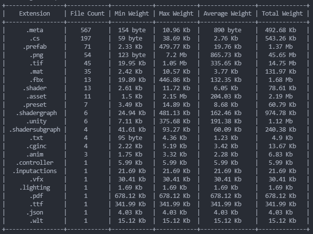

# FileAnalyzer

FileAnalyzer is a tool used to get information on files inside a folder, intended for programmers.

Using this tool you can know:
- How many files of each type you have
- Their size
- How many programming language files are inside the folder
- How many lines of code are there
- How many lines containing comments
- How many characters
- How many digits
- and other...
  
Here's an example output from a folder:

# Currently Supported

Currently only some features/languages/file formats are supported. These include:

Languages:
- Python
- CSharp

Other:
- png
- jpg
- jped
- mp3
- wav

# Contributing
Contributions are accepted!
To do so, creare a Pull Request with suggested changes and we'll discuss it and (hopefully) approve it.

If you don't know where to start you can look at the list of issues to know what still needs to be done.

# Dependencies

`audioread`, used to analyze audio files
`pip install audioread` to install it, if you don't have it.
